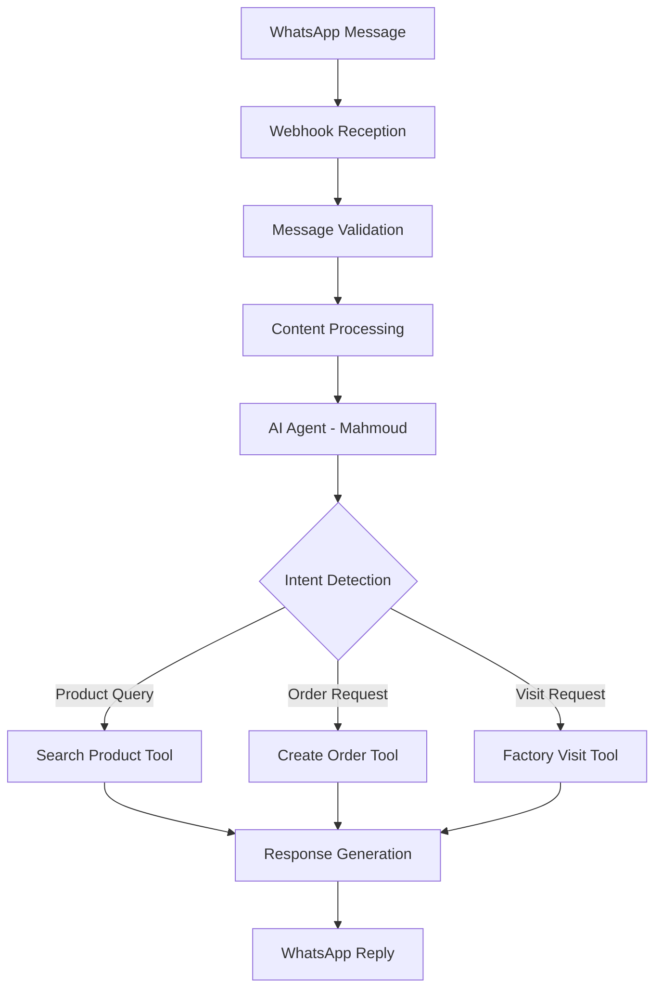

# Max Pharma - AI-Powered WhatsApp Customer Service Automation

[](https://n8n.io/)
[](https://ai.google.dev/)
[](https://developers.facebook.com/docs/whatsapp)
[](#license)

An intelligent WhatsApp-based customer service automation system built with N8N for Max Pharma, featuring an AI-powered agent named "Mahmoud" that handles customer inquiries in Egyptian Arabic with natural language processing.

## 🌟 Overview

Max Pharma specializes in high-quality raw materials for:
- **Cleaning Products** (liquid and powder detergents)
- **Skincare and Hair Care** products
- **Personal Care** products (shampoo, soap, creams, etc.)

This automation system provides 24/7 customer service through WhatsApp, handling product inquiries, order management, and factory visit scheduling with conversational AI.

## 🚀 Key Features

### 🤖 AI-Powered Customer Service
- **Natural Language Processing** in Egyptian Arabic
- **Context-Aware Conversations** with memory retention
- **Mood-Adaptive Responses** based on customer tone
- **Multi-Turn Dialogue** support

### 📱 Multi-Media Communication
- ✅ **Text Messages** - Full conversational support
- 🎵 **Voice Notes** - Audio message processing
- 📸 **Images** - Visual content handling
- 📄 **Documents** - File sharing capabilities

### 🛍️ Business Operations
- 🔍 **Smart Product Search** with semantic matching
- 📋 **Automated Order Processing** with validation
- 📅 **Factory Visit Scheduling** via Google Calendar
- 💰 **Real-time Pricing** information
- 📊 **Order Tracking** and management

## 🏗️ System Architecture



### 📁 Workflow Structure

| Workflow | File | Purpose |
|----------|------|---------|
| **Main Flow** | `Main flow.json` | Primary message processing and AI agent |
| **Product Search** | `Search Product.json` | Product database queries and pricing |
| **Order Creation** | `Create Order.json` | Order validation and Google Sheets logging |
| **Factory Visits** | `Factory visit.json` | Calendar integration and appointment management |

## 🛠️ Technology Stack

| Component | Technology | Purpose |
|-----------|------------|---------|
| **Automation Platform** | N8N | Workflow orchestration |
| **AI Model** | Google Gemini 2.5 Pro | Natural language processing |
| **Database** | Google Sheets | Product catalog and order storage |
| **Calendar** | Google Calendar API | Appointment scheduling |
| **Messaging** | WhatsApp (Evolution API) | Customer communication |
| **Memory** | Buffer Window Memory | Conversation context |

## ⚡ Quick Start

### Prerequisites

- [ ] N8N instance (cloud or self-hosted)
- [ ] Google Workspace account
- [ ] WhatsApp Business API access
- [ ] Google Gemini API key

### 🔧 Installation Steps

1. **Clone the Repository**
   ```bash
   git clone https://github.com/Ahmed-Esso/N8N-Customer-Service.git
   cd N8N-Customer-Service
   ```

2. **Import N8N Workflows**
   ```bash
   # Import these JSON files into your N8N instance:
   - Main flow.json
   - Search Product.json
   - Create Order.json
   - Factory visit.json
   ```

3. **Configure Credentials**
   
   Set up the following in N8N:
   - 🔑 **Google Sheets OAuth2 API**
   - 🔑 **Google Calendar OAuth2 API**
   - 🔑 **Google Gemini API**
   - 🔑 **Evolution API for WhatsApp**

4. **Set Up Google Sheets**
   
   Create sheets with these structures:
   
   **Products Sheet:**
   | Product Name | Price | Specifications |
   |--------------|-------|----------------|
   | Stearic Acid | 150 | Technical grade... |
   
   **Orders Sheet:**
   | order_id | phone | Products_items | Order_Details | status | order_date | delivery_date |
   |----------|-------|----------------|---------------|--------|------------|---------------|

5. **Configure WhatsApp Webhook**
   ```bash
   # Point your Evolution API webhook to:
   https://your-n8n-instance.com/webhook/whatsapp
   ```

## 💬 Usage Examples

### Customer Conversation Flows

**🔍 Product Inquiry:**
```
👤 Customer: "عاوز أعرف سعر حمض ستيريك"
🤖 Mahmoud: "أهلاً وسهلاً، إزيك يا فندم؟ أنا محمود من خدمة عملاء Max Pharma. 
            السعر: 150 جنيه للكيلو. المواصفات تم إرسالها. 
            تحب نعمل أوردر توصيل؟"
```

**🛒 Order Creation:**
```
👤 Customer: "عاوز أطلب 10 كيلو L-Tyrosine"
🤖 Mahmoud: "تمام، تم إنشاء الأوردر بنجاح! 
            رقم الأوردر: ORD-12345678
            هيتم التواصل معاك لتأكيد التفاصيل النهائية والدفع."
```

**🏭 Factory Visit:**
```
👤 Customer: "عاوز أزور المصنع"
🤖 Mahmoud: "أهلاً وسهلاً! ممكن أعرف اسم حضرتك والموعد المناسب ليك؟"
```

## 🧠 AI Agent Behavior

### Conversation Intelligence
- **📚 Context Awareness** - Reads entire conversation history
- **👤 Personalization** - Uses customer name appropriately
- **🎭 Tone Adaptation** - Matches customer mood and urgency
- **🇪🇬 Egyptian Dialect** - Natural Arabic responses
- **⏱️ Tool Integration** - Waits for tool completion before responding

### Response Patterns

| Customer Type | Response Style | Example |
|---------------|----------------|---------|
| **😊 Friendly** | Light humor and warmth | "إزيك يا فندم؟ نورت!" |
| **😤 Upset** | Calming and empathetic | "متأسف للإزعاج، هنحل الموضوع دلوقتي" |
| **⚡ Hurried** | Quick and direct | "تمام، السعر 150 جنيه. عاوز تطلب؟" |
| **😠 Difficult** | Professional boundaries | "أقدر ظروفك، بس النظام كده للجميع" |

## 📊 Monitoring & Analytics

### Key Performance Indicators
- ⚡ **Response Time** - Average message processing duration
- ✅ **Success Rate** - Tool execution success percentage
- 😊 **Customer Satisfaction** - Based on conversation tone analysis
- 💰 **Conversion Rate** - Inquiry to order conversion
- 🎯 **Accuracy Score** - Response relevance and correctness

### 📈 Logging & Tracking
- 💾 **Conversation History** - All interactions with timestamps
- 📋 **Order Records** - Complete order details in Google Sheets
- 🚨 **Error Tracking** - Failed operations monitoring
- 📊 **Usage Analytics** - Peak hours and popular products

## 🔒 Security & Privacy

- 🔐 **Data Encryption** - All API communications secured
- 👤 **Privacy Compliance** - Customer data protection standards
- 🔑 **Access Control** - Limited permissions for sensitive operations
- 🛡️ **Error Handling** - Graceful failure management
- 🔍 **Audit Trail** - Complete operation logging

## 🚧 Roadmap

### 🔮 Upcoming Features
- [ ] **💳 Payment Integration** - Direct payment processing
- [ ] **📦 Inventory Management** - Real-time stock tracking
- [ ] **🌍 Multi-language Support** - Arabic, English, French
- [ ] **📊 Advanced Analytics** - Customer behavior insights
- [ ] **📱 Mobile App** - Native mobile experience
- [ ] **🔄 CRM Integration** - Customer relationship management

### 🎯 Version History
- **v1.0** - Initial release with basic automation
- **v1.1** - Added voice message support
- **v1.2** - Enhanced AI responses with Egyptian dialect
- **v1.3** - Factory visit scheduling integration

## 🤝 Contributing

We welcome contributions! Please see our [Contributing Guidelines](CONTRIBUTING.md) for details.

### Development Setup
1. Fork the repository
2. Create a feature branch (`git checkout -b feature/amazing-feature`)
3. Make your changes
4. Test thoroughly with N8N
5. Commit your changes (`git commit -m 'Add amazing feature'`)
6. Push to the branch (`git push origin feature/amazing-feature`)
7. Open a Pull Request

## 📸 Workflow Screenshots

### 🔄 Main Flow

*The central workflow that handles all WhatsApp messages and coordinates with AI agent Mahmoud*

### 🔍 Search Product Flow  

*Intelligent product search with semantic matching and pricing retrieval*

### 📋 Create Order Flow

*Automated order processing with validation and Google Sheets integration*

### 📅 Factory Visit Flow

*Calendar integration for scheduling and managing factory visit appointments*

## 🙏 Acknowledgments

- **N8N Team** for the amazing automation platform
- **Google** for Gemini AI and Workspace APIs  
- **Evolution API** for WhatsApp Business integration

---

<div align="center">

**Built with ❤️ using N8N Workflow Automation**

[⭐ Star this repo](https://github.com/Ahmed-Esso/N8N-Customer-Service) | [🐛 Report Bug](https://github.com/Ahmed-Esso/N8N-Customer-Service/issues) | [✨ Request Feature](https://github.com/Ahmed-Esso/N8N-Customer-Service/issues)

</div>
